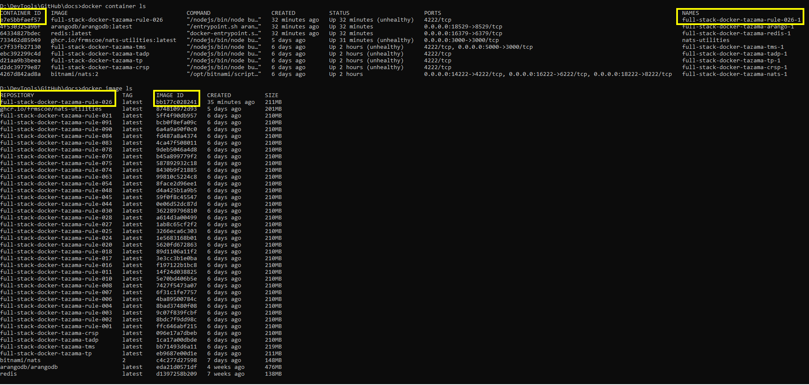
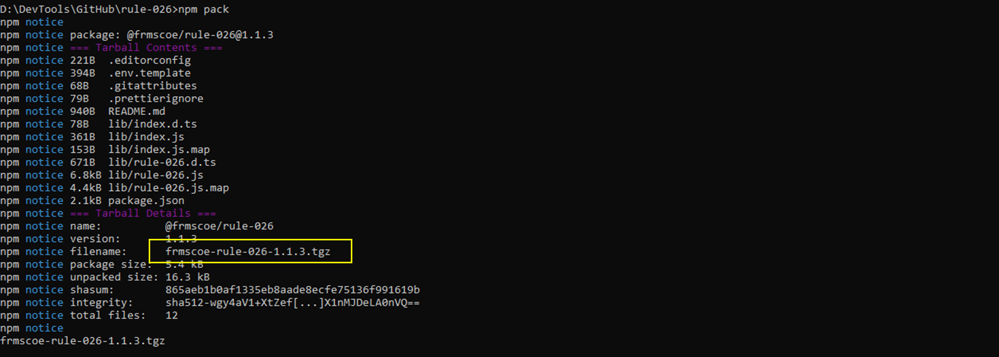
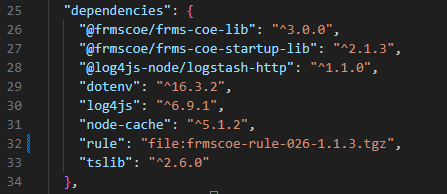
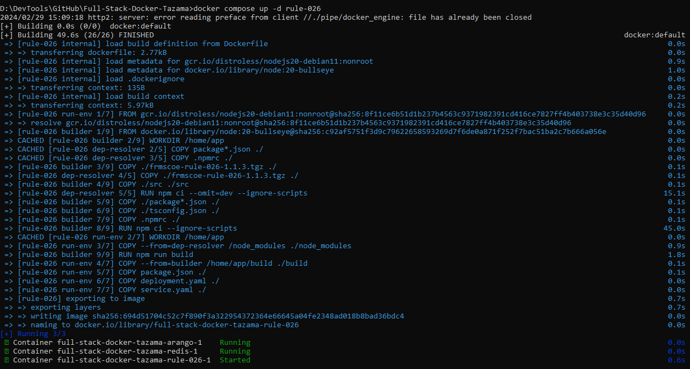

## Introduction

This guide will take you through the steps to deploy a rule processor from a test branch into a full-service full-stack deployment of Tazama on a single local Windows machine via Docker Compose.

This guide is specific to the Windows 10 operating system.

## Pre-requisites

Set up your development environment as recommended in the [Tazama Contribution Guide](../Community/Tazama-Contribution-Guide.md#32-setting-up-the-development-environment).

Set up the full-service, full-stack deployment of Tazama via Docker Compose as recommended in the [Full Service Full Stack Docker Tazama](./full-service-full-stack-docker-tazama.mdfull-service) guide.

If you followed these guides to their conclusion, you should have a fully functional implementation of Tazama running in Docker on your local machine.

## New or Existing Rule Processor?

When we want to deploy a new rule processor, we should always test that rule processor from a test branch in our GitHub repository before we merge the processor code into our `main` branch. This would be the case for both brand new processors, as well as updates to existing processors.

If you are deploying a brand new rule processor, you can carry on with this guide from the section, but if you are updating an existing rule processor that you want to test before merging to main, you have some work to do to prepare our existing and running Tazama implementation for the testing.

For this guide, we will be working with rule-026 as an example.

## Removing an existing rule processor

### 1. Removing the rule processor from Docker

Tazama will already contain an existing and running version of the main branch rule processor in your Docker environment. We need to remove this container and its image from Docker with the following commands, executed from a Windows Command Prompt.

First, we stop the container:

```
docker container stop container-name
```

Output:


Then we remove the image:

```
docker image rm image-name -f
```

Output:


 - Replace the string `container-name` in the commands above with the name or ID of the container that you would like to stop
    - To view a list of the current running containers, use the command:
        ```
        docker container ls
        ```
        The name of the container is found in the "NAMES" column.

        The ID of the container is found in the "CONTAINER ID" column.
 - Replace the string `image-name` in the commands above with the name or ID of the image you would like to remove

    - To view a list of the current running containers, use the command:
        ```
        docker image ls
        ```
        The name of the image is found in the "REPOSITORY" column.

        The ID of the image is found in the "IMAGE ID" column.

        

### 2. Clean up the rule-executer folder

When we previously deployed each rule processor, we created individual rule-executer folders to wrap each rule processor for deployment into their Docker containers.

Find the folder that you created for the specific rule processor that you want to remove, and delete it. You can perform this task from the Windows Explorer, or from a Command Prompt with the following command while in your GitHub source folder:

```
rd /s /q "rule-executer-xxx"
```
Replace `rule-executer-xxx` with the folder that represents your rule processor's specific rule executer

## Building a rule processor from a specific code branch in GitHub

These steps will help you deploy a test branch of a rule processor into the Tazama Docker environment.

### Clone the rule processor branch

From your GitHub source folder on your local machine, type the following command to clone the test branch of your rule processor to a local folder:

```
git clone repository -b branch
```

 - Replace `repository` with the URL of your rule processor repository
 - Replace `branch` with the name of your test branch that you would like to deploy

Output:


### Build your rule processor binary package file

The following commands will allow you to compile your rule processor code into a binary "tarball" package file that we can package into a rule executer for deployment into a Docker container.

Change your folder to the rule processor root folder:

```
cd rule-xxx
```
 - Replace the `xxx` in `rule-xxx` with the number of the rule processor you just cloned.

First, we install all the code dependencies by executing the following command from within the rule processor root folder:

```
npm install
```

Output:


Then, we have to build our rule processor with the command:

```
npm run build
```

Output:


And finally, we have to create our binary package file with the command:

```
npm pack
```

Output:



You should now have a new `.tgz` file in your rule processor root folder. The name of the file is displayed in the result of the `npm pack` command next to the `filename` key, but you can also see it with a `dir` command or in the File Explorer.

### Prepare a rule executer for your new rule

#### 1. Copy the rule-executer folder

Similar to how we created a rule executer wrapper for our rule processors during the deployment of a full-service, full-stack Docker Tazama, we want to make a copy of our rule-executer folder that we had previously prepared.

(See the [Full Service Full Stack Docker Tazama](./full-service-full-stack-docker-tazama.mdfull-service#clone-the-rule-executer-repository) guide for a reminder of the steps to clone and prepare the rule executer.)

With the default rule executer set up, you can now make a copy of the rule executer to host your specific rule processor, as we did before in the [Full Service Full Stack Docker Tazama](./full-service-full-stack-docker-tazama.md#1-copy-the-rule-executer-folder) guide with the following command from your GitHub source folder:

```
xcopy rule-executer rule-executer-xxx /E /I /H
```
 - Replace the `xxx` in `rule-executer-xxx` with your rule processor number.

From here onwards, the process deviates somewhat from our previous installation of the rule processors. Where we had previously installed a rule processor from its main branch hosted on GitHub, we now want to deploy the processor using the local binary we created in the previous step.

To achieve this, we need to update the `Dockerfile` and the `package.json` files in the `rule-executer-xxx` folder in a different way.

#### 2. Copy your binary package file to the new rule-executer folder

Navigate to the GitHub source folder and type the following command to copy the binary package file to the rule-executer folder:

```
copy rule-xxx\rule-binary-filename.tgz rule-executer-xxx
```
 - `rule-xxx` is the folder of your new rule processor
 - `rule-binary-filename.tgz` is the filename of the binary package file we compiled earlier
 - `rule-executer-xxx` is the folder of your new rule executer

Output:


#### 3. Update the package.json file

Navigate to the new `rule-executer-xxx` folder and start VS Code from there.

In VS Code, open the `package.json` file and update the `dependencies.rule` value from `"npm:@frmscoe/rule-901@^1.0.7"` to `"file:rule-binary-filename.tgz"`.

 - `rule-binary-filename.tgz` is the filename of the binary package file

Output:



Save the file.

#### 4. Update the Dockerfile

In VS Code, open the `Dockerfile` file and update the file with the following:

Find the `WORKDIR /home/app` string (line 10) and add the following string in a new line below it:
```
COPY ./frmscoe-rule-026-1.1.3.tgz ./
```

Find the `COPY .npmrc ./` string (now line 26) and add the following string in a new line below it:
```
COPY ./frmscoe-rule-026-1.1.3.tgz ./
```

Find and update the `RULE_NAME` environment variable value from `"901"` to `"xxx"`, where `xxx` is your rule processor number.

Output:


Save the file.

#### 5. Install software dependencies

Back in your Windows Command Prompt, from your `rule-executor-xxx` folder, execute the following command to install all the software dependencies and the rule processor binary package for the rule processor:

```
npm install rule@file:rule-binary-filename.tgz
```

 - `rule-binary-filename.tgz` is the filename of the binary package file

Output:


#### 6. Deploy the processor

And, finally, we can deploy the processor into Docker! Navigate back to the `Full-Stack-Docker-Tazama` folder, and run the command:

```
docker compose up -d rule-xxx
```

 - Replace the `xxx` in `rule-xxx` with your rule processor number.

Output:



Your rule processor should now be up and running in your local full-service, full-stack Tazama Docker evironment! You can verify the status of your rule processor through the Docker Desktop, or by running a `docker container ls` command.