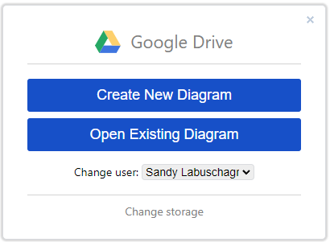
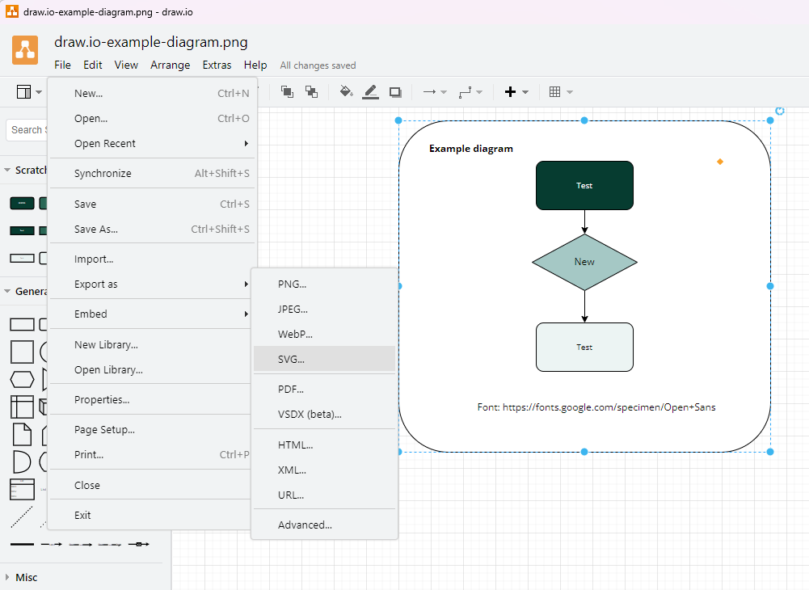
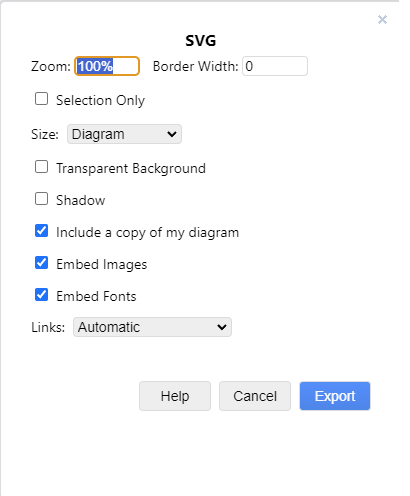
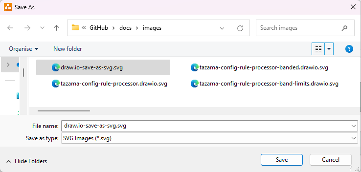
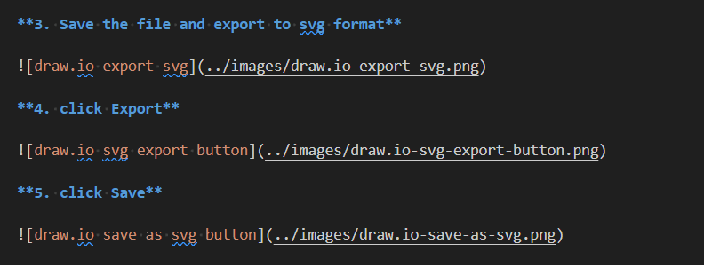

<!-- SPDX-License-Identifier: Apache-2.0 -->

- [Introduction](#introduction)
- [Tazama Template](#tazama-template)
- [Create and Update diagrams in draw.io](#create-and-update-diagrams-in-drawio)
- [Embed diagrams in markdown files](#embed-diagrams-in-markdown-files)

## Introduction

This guide will take you through the steps to embed a Draw.io diagram into a markdown file.

For the purposes of this guide, I am using a folder \\\GitHub\docs which you can copy by cloning the `docs` repository to a GitHub folder in your local environment

. 

In the example in this guide, the location images for this repository were saved here

. 

## Tazama Template

The Tazama template with the color palette and font can be found the location \\\GitHub\docs\files\templates\Tazama-template.drawio.png 
Copy the file from your local location where you cloned the docs repository to your preferred working file location.  .   

**1. Access the website https://www.drawio.com/ and click on `Start` button.**

.  

**2. Select `Open Existing Diagram` and find the Tazama template file you just saved**

[Top](#introduction)

## Create and Update diagrams in draw.io

**3. Save the file and export to svg format**

**4. click Export**

**5. click Save**

## Embed diagrams in markdown files

