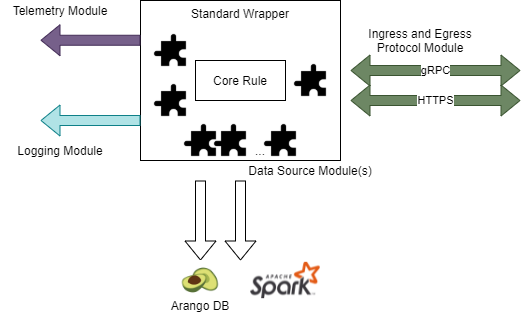
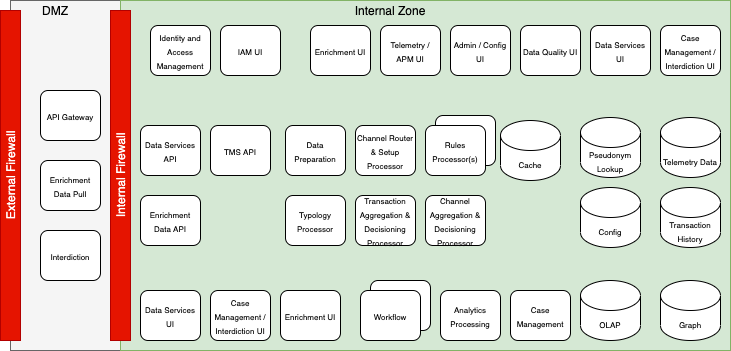
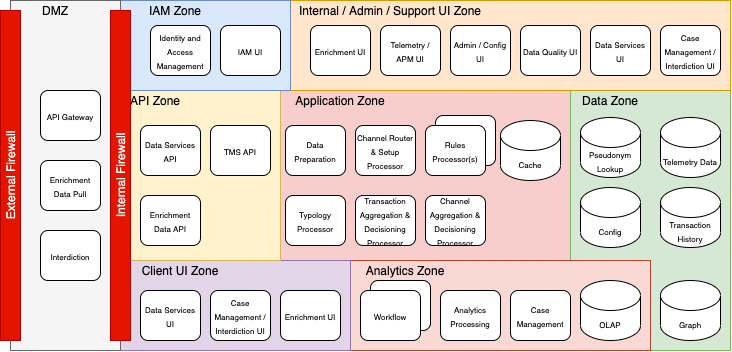
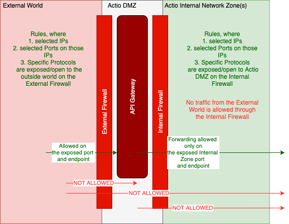
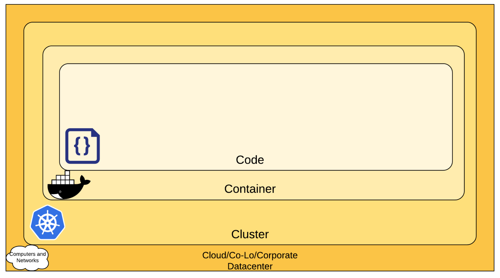

# Security

- [Security](#security)
  - [Overview](#overview)
  - [Network](#network)
    - [Low-budget](#low-budget)
    - [Intermediate](#intermediate)
    - [Enterprise-grade](#enterprise-grade)
  - [Ingress](#ingress)
  - [Network Policy](#network-policy)
    - [Example Network Policy](#example-network-policy)
      - [Ingress](#ingress-1)
      - [Egress](#egress)
  - [Control Plane](#control-plane)
    - [Low-budget setup:](#low-budget-setup)
    - [Intermediate setup:](#intermediate-setup)
    - [Enterprise-grade setup:](#enterprise-grade-setup)
  - [Kubernetes Hosts](#kubernetes-hosts)
  - [Kubernetes Version](#kubernetes-version)
  - [Kubernetes Components](#kubernetes-components)
    - [Control network access to sensitive ports](#control-network-access-to-sensitive-ports)
  - [Direct Access to Kubernetes Nodes](#direct-access-to-kubernetes-nodes)
    - [Controlling access to the Kubernetes API](#controlling-access-to-the-kubernetes-api)
    - [Use Transport Layer Security](#use-transport-layer-security)
    - [API Authentication](#api-authentication)
    - [API Authorization - Implement role-based access control](#api-authorization---implement-role-based-access-control)
    - [Restrict access to etcd](#restrict-access-to-etcd)
      - [Important Note](#important-note)
    - [Controlling access to the Kubelet](#controlling-access-to-the-kubelet)
    - [Securing Kubernetes Dashboard](#securing-kubernetes-dashboard)
      - [If you do plan to install and use Kubernetes Dashboard then](#if-you-do-plan-to-install-and-use-kubernetes-dashboard-then)
  - [Data Plane / Containers](#data-plane--containers)
    - [Kubernetes Security](#kubernetes-security)
      - [Cloud Security](#cloud-security)
      - [Cluster Security](#cluster-security)
      - [Container Security](#container-security)
      - [Code Security](#code-security)
    - [Linkerd Service Mesh](#linkerd-service-mesh)
    - [gRPC](#grpc)
  - [File System](#file-system)
  - [Datastore](#datastore)
    - [Secure connection to the datastores](#secure-connection-to-the-datastores)
      - [Secure connection to Document store (Druid)](#secure-connection-to-document-store-druid)
      - [Secure connection to Graph store (ArangoDB)](#secure-connection-to-graph-store-arangodb)
      - [Authentication and Authorization in Document store (Druid)](#authentication-and-authorization-in-document-store-druid)
      - [Authentication and Authorization in Document store (ArangoDB)](#authentication-and-authorization-in-document-store-arangodb)
      - [Encryption at Rest (Druid)](#encryption-at-rest-druid)
      - [Encryption at Rest (ArangoDB)](#encryption-at-rest-arangodb)
  - [Transient Data](#transient-data)
    - [Logs](#logs)
    - [UI](#ui)
    - [Hacked code or config](#hacked-code-or-config)
    - [Data History](#data-history)
  - [Configuration](#configuration)
    - [System Configurations](#system-configurations)
      - [Hardware Configurations](#hardware-configurations)
      - [Kubernetes](#kubernetes)
      - [Tazama architecture products](#tazama-architecture-products)
  - [Code](#code)
  - [Role Based Secure Access](#role-based-secure-access)
  - [Cryptographic Controls](#cryptographic-controls)
  - [Data Protection](#data-protection)
  - [Audit Logging](#audit-logging)
  - [Token Requirements](#token-requirements)
  - [Password Requirements](#password-requirements)

## Overview

Tazama platform is Kubernetes native. It can be deployed either on-premise or on one of the popular cloud providers including Amazon AWS, Google GCP or Microsoft Azure. Security has to be applied at multiple levels.

1. Network
2. Ingress
3. Network Policy
4. Control Plane
5. Kubernetes Hosts
6. Kubernetes Version
7. Kubernetes Components
8. Direct Access to Kubernetes Nodes
9. Data Plane / Containers and Inter-Service communication
10. File System
11. Datastore
12. Transient Data
13. Configuration
14. Code
15. Role Based Secure Access
16. Cryptographic Controls
17. Data Protection
18. Audit Logging
19. Token Requirements
20. Password Requirements

Tazama is design to work either On-Premise or with the Cloud provider products. In either of those setups Tazama is designed to be deployed on either Physical or Virtual Machines. It is not designed to work with Kubernetes-based / Managed products provided by the Cloud providers.

## Network

Tazama platform can be installed in any of the following three network architectures. There could be other architectures that you can implement the network but here are the absolute minimum expectations:

1. Hardware that has access to the internet
2. Have an external firewall

The three network architectures are:

1. Low-budget
2. Intermediate
3. Enterprise-grade

Network and zoning creates secure infrastructure that can be monitored. Access between any two zones is configured to be **Deny-by-default** and then specific ports are opened in specific directions to specific components.

### Low-budget

By satisfying the absolute minimum expectations, Tazama can be installed in low-budget infrastructures with just one subnet. Here is how the network architecture should look like



### Intermediate

Tazama platform recommends having at-least 2 subnets (internal and DMZ) but it does not require that.



### Enterprise-grade

Tazama platform is designed to be installed in enterprise grade infrastructure. It implies having multiple subnets includes a DMZ.



***Tazama recommends Enterprise-grade setup because it is a lot more secure***

## Ingress

Tazama platform includes Apache Ambassador as the API Gateway. DMZ is created using External and Internal Firewall. The network zones behind the internal firewall cannot be directly accessed from outside the External Firewall. Ports are open on the internal firewall and they can only be accessed by the API Gateway. API Gateway receives all the traffic that comes from outside the external firewall. API Gateway does the authentication and authorization based on the tokens provided by the IAM and does the traffic forwarding to the internal zones. Ingress traffic API Gateway is configured to **Deny-by-default.** API Gateway is set up to only allow **HTTPS** ingress traffic.



***Tazama recommends that you have External and Internal Firewall setup and configured and that the API Gateway is hosted between the 2 firewalls***

## Network Policy

NetworkPolicies are an application-centric construct which allow you to specify how a pod is allowed to communicate with various network "entities" over the network.

The entities that a Pod can communicate with are identified through a combination of the following 3 identifiers:

1. Other pods that are allowed (exception: a pod cannot block access to itself)

2. Namespaces that are allowed

3. IP blocks (exception: traffic to and from the node where a Pod is running is always allowed, regardless of the IP address of the Pod or the node)

[https://kubernetes.io/docs/concepts/services-networking/network-policies/](https://kubernetes.io/docs/concepts/services-networking/network-policies/)

***Network Policy recommendation for Tazama platform: You have a network policy implemented and Default deny all ingress and all egress traffic***

### Example Network Policy

```yaml
apiVersion: networking.k8s.io/v1
kind: NetworkPolicy
metadata:
  name: test-network-policy
  namespace: default
spec:
  podSelector:
    matchLabels:
      role: db
  policyTypes:
  - Ingress
  - Egress
  ingress:
  - from:
  - ipBlock:
        cidr: 172.17.0.0/16
        except:
    - 172.17.1.0/24
  - namespaceSelector:
        matchLabels:
          project: myproject
  - podSelector:
        matchLabels:
          role: frontend
    ports:
  - protocol: TCP
      port: 6379
  egress:
  - to:
  - ipBlock:
        cidr: 10.0.0.0/24
    ports:
  - protocol: TCP
      port: 5978
```

#### Ingress

```yaml
  ...
  ingress:
  - from:
  - namespaceSelector:
        matchLabels:
          user: DBMgr
      podSelector:
        matchLabels:
          role: db
  ...
```

#### Egress

```yaml
  ...
  ingress:
  - from:
  - namespaceSelector:
        matchLabels:
          user: DBMgr
  - podSelector:
        matchLabels:
          role: db
  ...
```

## Control Plane

The *control plane* is a set of services that run in a dedicated namespace. These services accomplish various things—aggregating telemetry data, providing a user-facing API, providing control data to the data plane proxies, etc. Together, they drive the behavior of the data plane.

The Controller hosts an API that can be accessed using CLI or Web UI.


### Low-budget setup:

The dedicated namespace will be in the Internal Network Zone and not accessible outside the External Firewall.

### Intermediate setup:

If there is an Internal Firewall, this Control Plane namespace will not be accessible outside the Internal Firewall.

### Enterprise-grade setup:

Control Plane user-facing API and CLI will only be exposed to the Admins (Internal / Admin / Support UI Zone) and not outside the Internal Firewall.

***Tazama recommendation for the Control Plane: Enterprise-grade setup***

## Kubernetes Hosts

Kubernetes was designed to be highly portable and customers can easily switch between these installations, migrating their workloads.

All of this potential customisation of Kubernetes means it can be designed to fit a large variety of scenarios; however, this is also its greatest weakness when it comes to security. Kubernetes is designed out of the box to be customizable and users must turn on certain functionality to secure their cluster. This means that the engineers responsible for deploying the Kubernetes system need to know about all the potential attack vectors and vulnerabilities poor configuration can lead to.

***Tazama recommends to harden the underlying hosts by***

- ***installing the latest version of operating system***
- ***hardening the operating system***
- ***implement necessary patch management and configuration management system***

## Kubernetes Version

The best defense is to make sure that you are running the latest available version of Kubernetes. Here is the link to Kubernetes Version Skew Policy [https://kubernetes.io/docs/setup/release/version-skew-policy/](https://kubernetes.io/docs/setup/release/version-skew-policy/)

***Tazama recommends several techniques such as***

- ***rolling updates***
- ***node pool migrations***

***that allow you to complete an update with minimal disruption and downtime.***

## Kubernetes Components

### Control network access to sensitive ports

Kubernetes clusters usually listen on a range of well-defined and distinctive ports which makes it easier identify the clusters and attack them. Hence it is highly recommended to configure authentication and authorization on the cluster and cluster nodes.

Here is an overview of the default ports used in Kubernetes.

***Tazama recommends that your network blocks access to ports and consider limiting access to the Kubernetes API server except from trusted networks.***

**Master node(s):**

| Protocol | Port Range | Purpose |
| --- | --- | --- |
| TCP | 6443- | Kubernetes API Server |
| TCP | 2379-2380 | etcd server client API |
| TCP | 10250 | Kubelet API |
| TCP | 10251 | kube-scheduler |
| TCP | 10252 | kube-controller-manager |
| TCP | 10255 | Read-Only Kubelet API |

**Worker nodes:**

| Protocol | Port Range | Purpose |
| --- | --- | --- |
| TCP | 10250 | Kubelet API |
| TCP | 10255 | Read-Only Kubelet API |
| TCP | 30000-32767 | NodePort Services |

## Direct Access to Kubernetes Nodes

***Tazama recommends that you limit SSH access to Kubernetes nodes,***

It reduces the risk for unauthorized access to host resource. Instead you should ask users to use "kubectl exec", which will provide direct access to the container environment without the ability to access the host.

You can use Kubernetes Authorization Plugins to further control user access to resources. This allows defining fine-grained-access control rules for specific namespace, containers and operations.

### Controlling access to the Kubernetes API

The Kubernetes system is controlled using API requests and as such is the first line of defense against attackers. Controlling who has access and what actions they are allowed to perform is the primary concern. For more information, refer to the documentation at [https://kubernetes.io/docs/reference/access-authn-authz/controlling-access/](https://kubernetes.io/docs/reference/access-authn-authz/controlling-access/)

***Tazama recommends that you implement Transport security, Authentication, Authorization, Admission Control and that the ports are secure***

### Use Transport Layer Security

Communication in the cluster between services should be handled using TLS, encrypting all traffic by default. This, however, is often overlooked with the thought being that the cluster is secure and there is no need to provide encryption in transit within the cluster.

Advances in network technology, such as the service mesh, have led to the creation of products like LinkerD and Istio which can enable TLS by default while providing extra telemetry information on transactions between services.

Kubernetes expects that all API communication in the cluster is encrypted by default with TLS, and the majority of installation methods will allow the necessary certificates to be created and distributed to the cluster components. Note that some components and installation methods may enable local ports over HTTP and administrators should familiarize themselves with the settings of each component to identify potentially unsecured traffic.

To learn more on usage of TLS in Kubernetes cluster, refer to the documentation at [https://kubernetes.io/blog/2018/07/18/11-ways-not-to-get-hacked/#1-tls-everywhere](https://kubernetes.io/blog/2018/07/18/11-ways-not-to-get-hacked/#1-tls-everywhere)

Tazama has API communication as well as gRPC

***Tazama recommends that all API and gRPC communication in the cluster is encrypted by default with TLS***

### API Authentication

Kubernetes provides a number of in-built mechanisms for API server authentication, however these are likely only suitable for non-production or small clusters.

- [Static Token File](https://kubernetes.io/docs/reference/access-authn-authz/authentication/#static-token-file)
     authentication makes use of clear text tokens stored in a CSV file on API server node(s). Modifying credentials in this file requires an API server re-start to be effective.
- [X509 Client Certs](https://kubernetes.io/docs/reference/access-authn-authz/authentication/#x509-client-certs)
     are available as well however these are unsuitable for production use, as Kubernetes does [not support certificate revocation](https://github.com/kubernetes/kubernetes/issues/18982) meaning that user credentials cannot be modified or revoked without rotating the root certificate authority key an re-issuing all cluster certificates.
- [Service Accounts Tokens](https://kubernetes.io/docs/reference/access-authn-authz/authentication/#service-account-tokens)
     are also available for authentication. Their primary intended use is to allow workloads running in the cluster to authenticate to the API server, however they can also be used for user authentication.

***Tazama recommends using KeyCloak for IAM / API Authentication. KeyCloak is already part of the Tazama platform***

If you want to use alternatives to Keyclock then the recommended approach for larger or production clusters, is to use an external authentication method:

- [OpenID Connect](https://kubernetes.io/docs/reference/access-authn-authz/authentication/#openid-connect-tokens)

     (OIDC) lets you externalize authentication, use short lived tokens, and leverage centralized groups for authorization.

- Managed Kubernetes distributions such as GKE, EKS and AKS support authentication using credentials from their respective IAM providers.

- [Kubernetes Impersonation](https://kubernetes.io/docs/reference/access-authn-authz/authentication/#user-impersonation)

     can be used with both managed cloud clusters and on-prem clusters to externalize authentication without having to have access to the API server configuration parameters.

***In addition to choosing the appropriate authentication system, Tazama recommends that the API access should be considered privileged and use Multi-Factor Authentication (MFA) for all user access***

For more information, consult Kubernetes authentication reference document at [https://kubernetes.io/docs/reference/access-authn-authz/authentication](https://kubernetes.io/docs/reference/access-authn-authz/authentication)

### API Authorization - Implement role-based access control

In Kubernetes, you must be authenticated (logged in) before your request can be authorized (granted permission to access). Kubernetes expects attributes that are common to REST API requests. This means that Kubernetes authorization works with existing organization-wide or cloud-provider-wide access control systems which may handle other APIs besides the Kubernetes API.

Kubernetes authorizes API requests using the API server. It evaluates all of the request attributes against all policies and allows or denies the request. All parts of an API request must be allowed by some policy in order to proceed. This means that permissions are denied by default.

Role-based access control (RBAC) is a method of regulating access to computer or network resources based on the roles of individual users within your organization.

Kubernetes ships an integrated Role-Based Access Control (RBAC) component that matches an incoming user or group to a set of permissions bundled into roles. These permissions combine verbs (get, create, delete) with resources (pods, services, nodes) and can be namespace or cluster scoped. A set of out of the box roles are provided that offer reasonable default separation of responsibility depending on what actions a client might want to perform. It is recommended that you use the Node and RBAC authorizers together, in combination with the NodeRestriction admission plugin.

RBAC authorization uses the [rbac.authorization.k8s.io](http://rbac.authorization.k8s.io) API group to drive authorization decisions, allowing you to dynamically configure policies through the Kubernetes API. To enable RBAC, start the API server with the --authorization-mode flag set to a comma-separated list that includes RBAC; for example:

```bash
kube-apiserver --authorization-mode=Example,RBAC --other-options --more-options
```

For detailed examples of utilizing RBAC, refer to Kubernetes documentation at [https://kubernetes.io/docs/reference/access-authn-authz/rbac](https://kubernetes.io/docs/reference/access-authn-authz/rbac)

***Tazama recommends you to enable RBAC***

More details on Actio’s RBAC can be found here [https://lextego.atlassian.net/wiki/spaces/ACTIO/pages/475332625/Security#Role-Based-Secure-Access](https://lextego.atlassian.net/wiki/spaces/ACTIO/pages/475332625/Security#Role-Based-Secure-Access)

### Restrict access to etcd

***Tazama recommends that you protect etcd differently from the rest of your cluster, example: isolate the etcd servers behind a firewall that only the API servers may access***

etcd is a critical Kubernetes component which stores information on state and secrets. Write access to the API server's etcd is equivalent to gaining root on the entire cluster, and even read access can be used to escalate privileges fairly easily.

The Kubernetes scheduler will search etcd for pod definitions that do not have a node. It then sends the pods it finds to an available kubelet for scheduling. Validation for submitted pods is performed by the API server before it writes them to etcd, so malicious users writing directly to etcd can bypass many security mechanisms - e.g. PodSecurityPolicies.

***Tazama recommends that the Administrators should always use strong credentials from the API servers to their etcd server, such as mutual auth via TLS client certificates***

#### Important Note

Allowing other components within the cluster to access the master etcd instance with read or write access to the full keyspace is equivalent to granting cluster-admin access. Using separate etcd instances for non-master components or using etcd ACLs to restrict read and write access to a subset of the keyspace is strongly recommended.

### Controlling access to the Kubelet

Kubelets expose HTTPS endpoints which grant powerful control over the node and containers. By default Kubelets allow unauthenticated access to this API.

***Tazama recommends that the Production clusters should enable Kubelet authentication and authorization***

For more information, refer to Kubelet authentication/authorization documentation at [https://kubernetes.io/docs/reference/command-line-tools-reference/kubelet-authentication-authorization](https://kubernetes.io/docs/reference/command-line-tools-reference/kubelet-authentication-authorization)

### Securing Kubernetes Dashboard

The Kubernetes dashboard is a webapp for managing your cluster. It it is not a part of the Kubernetes cluster itself, it has to be installed by the owners of the cluster.

***Tazama recommends that you do not install Kubernetes Dashboard unless there are roles (example: Admins) that plan to explicitly use it***

#### If you do plan to install and use Kubernetes Dashboard then

there are a lot of tutorials on how to do this. Unfortunately, most of them create a service account with very high privileges. This caused Tesla and some others to be hacked via such a poorly configured K8s dashboard. (Reference: Tesla cloud resources are hacked to run cryptocurrency-mining malware - [https://arstechnica.com/information-technology/2018/02/tesla-cloud-resources-are-hacked-to-run-cryptocurrency-mining-malware/](https://arstechnica.com/information-technology/2018/02/tesla-cloud-resources-are-hacked-to-run-cryptocurrency-mining-malware/) )

***To prevent attacks via the dashboard, Tazama recommends the following tips:***

- **Do not expose the dashboard** without additional authentication to the public. There is no need to access such a powerful tool from outside your LAN

- **Turn on RBAC**, so you can limit the service account the dashboard uses

- **Do not grant** the service account of the dashboard high privileges

- Grant permissions **per user**, so each user only can see what they are supposed to see

- If you are using network policies, you can **block requests to the dashboard even from internal pods** (this will not affect the proxy tunnel via kubectl proxy)

- Before version 1.8, the dashboard had a service account with full privileges, so check that there is no role binding for cluster-admin left. **Better to install dashboard with version > 1.8**

- Deploy the dashboard with an **authenticating reverse proxy**, with multi-factor authentication enabled. This can be done with either embeded OIDC `id_tokens` or using Kubernetes Impersonation. This allows you to use the dashboard with the user's credentials instead of using a privileged `ServiceAccount`. This method can be used on both on-prem and managed cloud clusters.

## Data Plane / Containers

### Kubernetes Security

Every component in the architecture is implemented as Kubernetes container and it comes with default security afforded by Kubernetes.



#### Cloud Security

Cloud Security implies Network security and File system security. Network security is covered in a section above and file system security is covered in a section below.

#### Cluster Security

Tazama platform implements Cluster Security using the following:

- RBAC Authorization [https://lextego.atlassian.net/wiki/spaces/ACTIO/pages/475332625/Security#Role-Based-Secure-Access](https://lextego.atlassian.net/wiki/spaces/ACTIO/pages/475332625/Security#Role-Based-Secure-Access)

- Authentication [https://lextego.atlassian.net/wiki/spaces/ACTIO/pages/475332625/Security#Role-Based-Secure-Access](https://lextego.atlassian.net/wiki/spaces/ACTIO/pages/475332625/Security#Role-Based-Secure-Access)

- Application Secrets Management [https://lextego.atlassian.net/wiki/spaces/ACTIO/pages/475332625/Security#File-System](https://lextego.atlassian.net/wiki/spaces/ACTIO/pages/475332625/Security#File-System)

- Network Policies [https://lextego.atlassian.net/wiki/spaces/ACTIO/pages/475332625/Security#Network-Policy](https://lextego.atlassian.net/wiki/spaces/ACTIO/pages/475332625/Security#Network-Policy)

- TLS for Kubernetes Ingress [https://lextego.atlassian.net/wiki/spaces/ACTIO/pages/475332625/Security#Ingress](https://lextego.atlassian.net/wiki/spaces/ACTIO/pages/475332625/Security#Ingress)

#### Container Security

Container Security for Kubernetes is implemented using Container Runtime Class (CRC). Tazama platform only recommends CRC for Enterprise-grade setup because implementing CRC sacrifices performance to achieve this extra level of security. There are enough security measures across different layers of the Tazama platform that CRC is only a recommendation.

#### Code Security

Code Security in Tazama platform is implemented using the following:

- mTLS [https://lextego.atlassian.net/wiki/spaces/ACTIO/pages/475332625/Security#Linkerd-Service-Mesh](https://lextego.atlassian.net/wiki/spaces/ACTIO/pages/475332625/Security#Linkerd-Service-Mesh)

- Limiting port ranges for communication

- Static Code Analysis

- Dynamic Probing Attacks

### Linkerd Service Mesh

On top of K8S security, all the components are service meshed using Linkerd which provides a proxy side car for accessing the pod rather than directly accessing the pod itself; this provides another layer of security.

Every line of communication between the components is through the Linkerd service mesh which is secured using mTLS.

### gRPC

Most of the lines of communication between the Tazama components is using gRPC (and when it it is not gRPC, then it is REST/HTTPS). gRPC messages have the following levels of security:

- SSL/TLS (Secure Sockets Layer / Transport Layer Security)
- ALTS (Application Layer Transport Security)

To summarize,

- all lines of communication between components are secured at multiple layers
- all components are inaccessible outside the firewall
- there is no UI access to any components in the Application Network Zone (critical path of Transaction Monitoring)
- All UI components are in a separate Network Zone than the Application Network Zone for controlled, Role-based and audit logged access

## File System

Tazama is Kubernetes-native system. Here are the following items that are persisted:

- Secrets - Secrets are persisted securely using Kubernetes. They include:
  - SSL keys
  - OAuth Tokens
  - JWT Tokens
  - Passwords
  - Docker Config
  - Basic Auth
  - SSH Auth
  - TLS Secrets
  - Anything else that needs to be secret

- [https://lextego.atlassian.net/wiki/spaces/ACTIO/pages/475332625/Security#Data/Datastore](https://lextego.atlassian.net/wiki/spaces/ACTIO/pages/475332625/Security#Data%2FDatastore)
- [https://lextego.atlassian.net/wiki/spaces/ACTIO/pages/475332625/Security#Configuration](https://lextego.atlassian.net/wiki/spaces/ACTIO/pages/475332625/Security#Configuration)
- [https://lextego.atlassian.net/wiki/spaces/ACTIO/pages/475332625/Security#Code](https://lextego.atlassian.net/wiki/spaces/ACTIO/pages/475332625/Security#Code)

Each secret type is used for a specific purpose and will be access only inside the Kubernetes pods. So any bad actor who gets access to the file system will not be able to decrypt the secrets.

## Datastore

All the datastores in the Tazama platform are recommended (Enterprise-grade installation) to be in their own Network zone that is firewall to allow access only certain other Network Zones, specific IPs (ranges) and ports. For Intermediate and Low-budget Tazama platform installation, we still have the protection of the External and/or Internal Firewalls and their rules.

On top of the above network security measures, here are the following ways Tazama secures the datastores (Document stores, Graph and SQL):

1. Secure connection to the datastores
2. Role-based Secure Access to the datastores
3. Encryption at Rest
4. Pseudonymization

### Secure connection to the datastores

Whether connecting via a UI or through code, the connection (datastore specific protocol) is set up to be secure.

#### Secure connection to Document store (Druid)

In Tazama platform, TLS is enabled for Druid to support HTTPS only connections. Thus all Read and Write actions are executed over a secure connection.

#### Secure connection to Graph store (ArangoDB)

In Tazama platform, TLS is enabled for ArangoDB to support HTTPS only connections. Thus all Read and Write actions are executed over a secure connection.

#### Authentication and Authorization in Document store (Druid)

In Tazama platform, the Authentication and Authorization is implemented using resources (Datasources, Configs and States) and actions (Read, Write).

#### Authentication and Authorization in Document store (ArangoDB)

In Tazama platform, the Authentication and Authorization for ArangoDB is managed within ArangoDB itself. The users of ArangoDB are different from those managed in KeyCloak. This is by design to ensure no external client/user can access the database. The Authentication and Authorization in ArangoDB are managed using ArangoDB provided Web UI which is hosted in a separate network zone (Enterprise-grade setup).

#### Encryption at Rest (Druid)

Druid provides encryption at Rest and this is an understated security measure. **Encryption at rest** is designed to prevent the attacker from accessing the unencrypted data by ensuring the data is **encrypted** when on disk. If an attacker obtains a hard drive with **encrypted** data but not the **encryption** keys, the attacker must defeat the **encryption** to read the data.

#### Encryption at Rest (ArangoDB)

ArangoDB, unfortunately, does not provide Encryption at Rest in the Community version. This is the main reason why ArangoDB is only used as a Graph Datastore in Tazama platform

## Transient Data

Tazama platform has many components. Transient Data covers data within various components of the Tazama platform. It does not cover Inter-Service communication (that is covered separately). Data is processed in Tazama components (including Data Preparation, Rules Processors etc). Tazama components write logs to ELK. Here are the possible Security vulnerabilities:

- Logs
- UI
- Hacked code or config
- Data History

### Logs

Tazama logs are explicitly designed to not include any PII or Data elements in the log statements.

### UI

Tazama platform does not have a UI for any of the Tazama components that process data in the critical path. This does not include the Datastore (Datastore security is addressed in a separate section)

### Hacked code or config

If hacked code or config, somehow even though highly unlikely, gets into the Tazama platform (example: code for any of the Rules Processors) then the data is protected in the following ways:

- Pseudonymization - Any PII elements of the data are pseudonymized and those elements can only be looked up for validation / confirmation. The hacked code will not be able to decrypt the pseudonymized data.
- Hacked code will attempt to write the code and push it out of Tazama platform to an outside location. The network policy and setup has tight control over egress (ports, IPs) to ensure that the written data cannot exit the Tazama platform.
- Hacked code will attempt to write to a file system. All Tazama components are Kubernetes pods/containers; File system security of Kubernetes will ensure that any data written to the disks is encrypted hence unusable.

### Data History

Transaction Data is written to the Datastore by one or more Tazama components. The data write is secure, the Datastore is secure, the network setup and policy are in place to ensure that no entity who is unauthorized can access the transaction data.

## Configuration

There are two types of configurations:

- System configurations
- Operational configurations

### System Configurations

This includes configurations of Hardware configurations, Kubernetes and Tazama architecture products (Linkerd, Druid, ArangoDB, gRPC etc)

#### Hardware Configurations

Hardware Configuration management will depend on whether Tazama is installed at a cloud provider (AWS, Azure or GCP) or on-premise.

Hardware Configuration for a cloud provider installation are secured by the cloud provider.

Hardware Configuration for a on-premise installation will have to be

- maintained in a private repo
- repo configuration updates should follow a Pull Request / Merge Request process (at a high-level: the configuration is managed in different git branches and updated based on review)
- deployment of configuration needs to be done using either
  - well designed and implemented CI/CD pipeline
  - secure access, if done manually
- file system security / encryption will need to be enabled
- no PII or data or transaction information should be present in the configuration

#### Kubernetes

Kubernetes Configuration management will depend on whether Tazama is installed using cloud provider provided Kubernetes or not.

Kubernetes Configuration for a cloud provider provided Kubernetes are secured by the cloud provider.

Kubernetes Configuration for a non-cloud provider provided will have to be

- maintained in the Tazama repo
- maintained as either yaml or json or docker file(s)
- repo configuration updates should follow a Pull Request / Merge Request process (at a high-level: the configuration is managed in different git branches and updated based on review)
- deployment of configuration needs to be done using either
  - well designed and implemented CI/CD pipeline
  - secure access, if done manually
- no PII or data or transaction information should be present in the configuration

#### Tazama architecture products

Configuration for Tazama architecture products (Linkerd, Druid, ArangoDB, gRPC etc) will have to be

- maintained in the Tazama repo
- maintained as either yaml or json file(s)
- repo configuration updates should follow a Pull Request / Merge Request process (at a high-level: the configuration is managed in different git branches and updated based on review)
- deployment of configuration needs to be done using either
  - well designed and implemented CI/CD pipeline
  - secure access, if done manually
- no PII or data or transaction information should be present in the configuration

## Code

Tazama platform will be available as an open source code base. It will be

- maintained in a public repo
- you can either update the public repo by creating your own branch and follow a Pull Request / Merge Request process (at a high-level: the code is managed in different git branches and updated based on review)
- you can also fork off the public repo and manage your fork yourself along with a Pull Request / Merge Request process
- deployment of code needs to be done using either
  - well designed and implemented CI/CD pipeline
  - secure access, if done manually
- file system security / encryption will need to be enabled
- no PII or data or transaction information should be present in the configuration
- code will have to be deployed / executed for various Tazama platform components

## Role Based Secure Access

RBAC authorization uses the `rbac.authorization.k8s.io` [API group](https://kubernetes.io/docs/concepts/overview/kubernetes-api/#api-groups-and-versioning) to drive authorization decisions, allowing you to dynamically configure policies through the Kubernetes API.

To enable RBAC, start the [API server](https://kubernetes.io/docs/concepts/overview/components/#kube-apiserver) with the `--authorization-mode` flag set to a comma-separated list that includes `RBAC`; for example:

```bash
kube-apiserver --authorization-mode=Example,RBAC --other-options --more-options
```

***Here are the items that Tazama recommends to address using Kubernetes:***

- limiting users and processes to certain namespaces
- Enabling the dividing of a cluster’s resources between multiple teams and users via resource quotas
- Providing an easy method of separating development, testing, and deployment of containerized applications enabling the entire lifecycle to take place on the same cluster
- Enabling specific roles to access specific components

For more details on RBAC Authorization using Kubernetes [https://kubernetes.io/docs/reference/access-authn-authz/rbac/](https://kubernetes.io/docs/reference/access-authn-authz/rbac/)

***Here are the Access Controls that Tazama recommends for its various components:***

- Access to any Tazama platform Datastores need to be managed separately. In case the IAM gets compromised, the access tokens/passwords to the Datastores will not be compromised.
- Access to send transactions to the Tazama platform (example: Hub, Switch, DFSP etc) needs to be centrally managed using IAM (KeyCloak)
- Acccess to any Tazama platform UIs need to be managed seperately. In case the IAM gets compromised, the access passwords to the Datastores will not be compromised.

## Cryptographic Controls

## Data Protection

## Audit Logging

## Token Requirements

## Password Requirements
