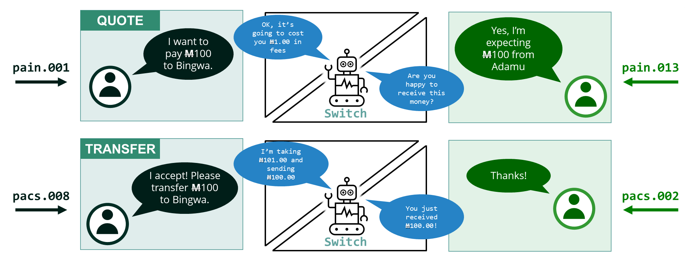

# The Transaction Monitoring Service API

The purpose of Transaction Monitoring Service (TMS) API is to facilitate the submission of a transaction to the Tazama platform so that the transaction can be evaluated for behaviour that may indicate financial crime, including fraud and money laundering.

The Tazama platform is designed to be able to take on transaction messages from customer platforms, evaluate these messages for specific behaviours, and deliver an assessment of the evidence of financial crime inherent in the transaction.

Tazama can be deployed to service the needs of a single Financial Service Provider (FSP), an intermediary platform such as a clearing house or payment switch, and also a combination of FSP and switching participants in what we call a “semi-attached” configuration:

In this configuration, the switching hub and FSPs both inside and outside the switching ecosystem can submit transaction messages to the Tazama platform for evaluation.

To facilitate this configuration, the Tazama platform exposes its services through its own API.

The TMS API implements ISO 20022 message formats to facilitate Payment Initiation messages `pain.001` and `pain.013` and Payment Settlement messages `pacs.008` and `pacs.002`.

ISO20022 is traditionally an XML-based standard, but Tazama has implemented an abridged JSON message format to minimize the message payload to increase the performance and reduce bandwidth requirements.

For more information on Tazama’s ISO 20022 implemented, see the [ISO20022 and Tazama](../Knowledge-Articles/iso20022-and-tazama.md) page.

The TMS API ingests transaction messages in real-time through the TMS API. The intention is to evaluate each transaction as they are performed, before they are sent to their destinations, to give Tazama an opportunity to evaluate the transaction before completion and to allow a transaction to be blocked.

By default, Tazama is set up to evaluate four transactions composed into a two-stage quote-and-transfer process:

With Tazama and the TMS API up and running, you can send the messages to their respective endpoints:

 - `host:port/execute` - receives a [pain.001 message](https://www.iso20022.org/standardsrepository/type/pain.001.001.11) to initiate a **quote request**
 - `host:port/quoteReply` - receives a [pain.013 message](https://www.iso20022.org/standardsrepository/type/pain.013.001.08) for the **quote response**
 - `host:port/transfer` - receives a [pacs.008 message](https://www.iso20022.org/standardsrepository/type/pacs.008.001.09) to initiate a **transfer request**
 - `host:port/transfer-response` - receives a [pacs.002 message](https://www.iso20022.org/standardsrepository/type/pacs.002.001.11) for the **transfer response**

The TMS API follows the OpenAPI specification and each incoming message is validated using a Swagger document to ensure that the message meets the requirements to be ISO 20022 compliant, and also that the information that is necessary for a successful evaluation is provided.

If a Tazama client platform is unable to submit messages in the required ISO 20022 format, client organizations would need to submit their transactions to a custom-built adaptor so that their transaction can be transformed and then passed to the Tazama platform to meet the specification of the Tazama Transaction Monitoring Service (TMS) API.

A [Mojaloop](https://mojaloop.io) Payment Platform Adapter has been developed and is hosted in the [Tazama GitHub Payment Platform Adapter repository](https://github.com/frmscoe/payment-platform-adapter).

Technical documentation for the implementation of the TMS API is covered in the [Transaction Monitoring Service (TMS) repository](https://github.com/frmscoe/tms-service).