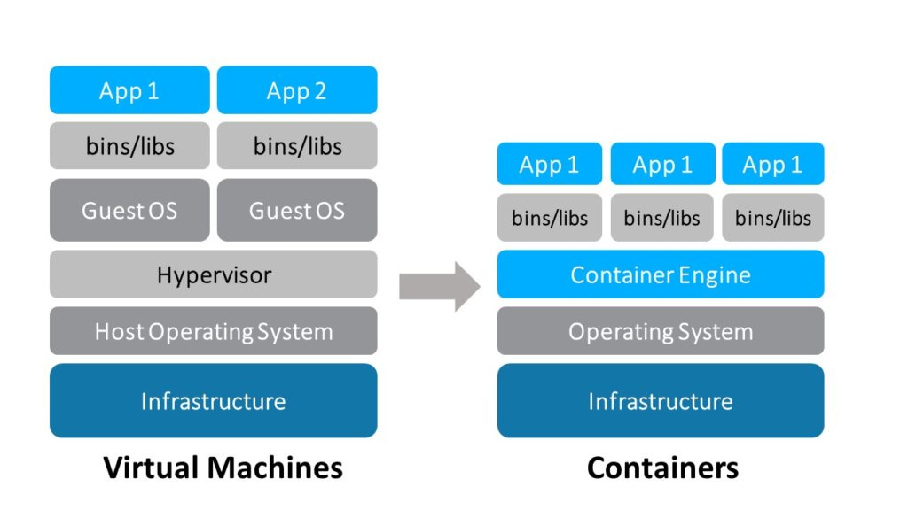
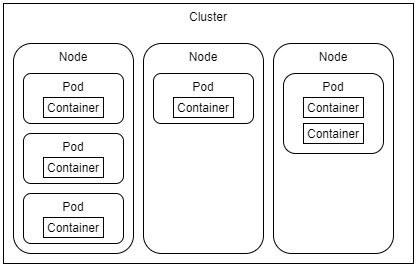
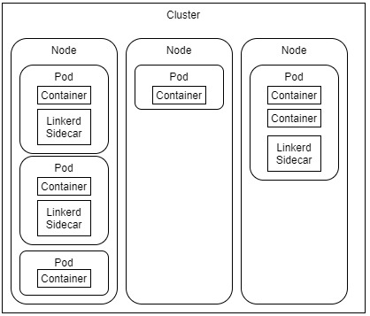
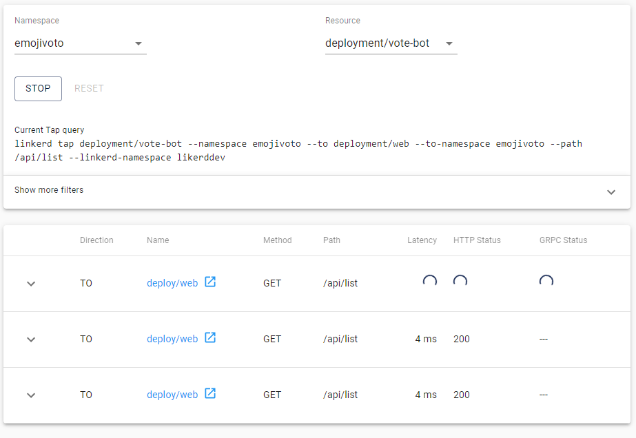
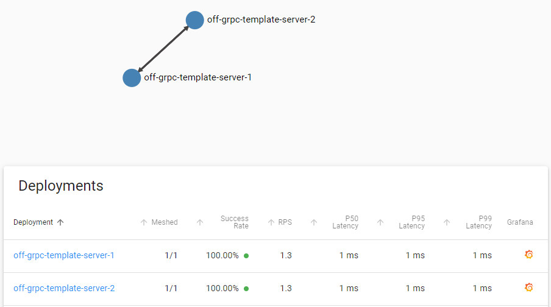
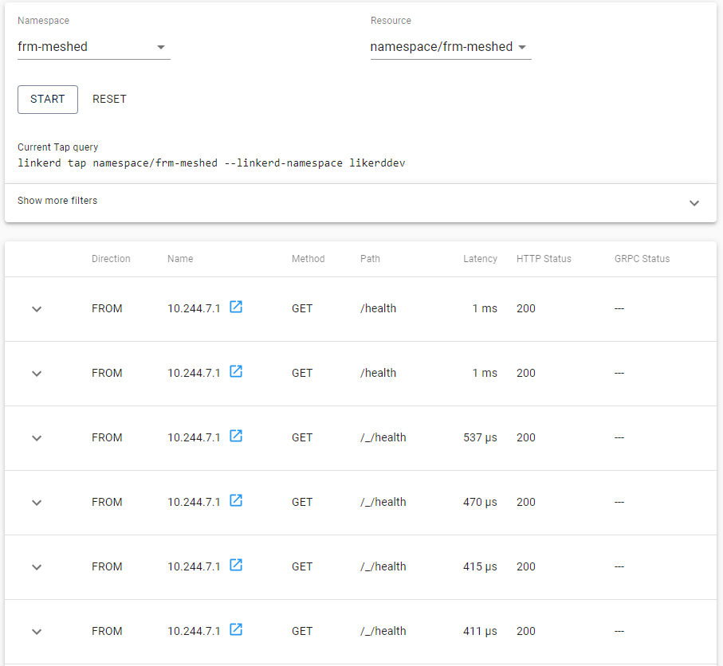
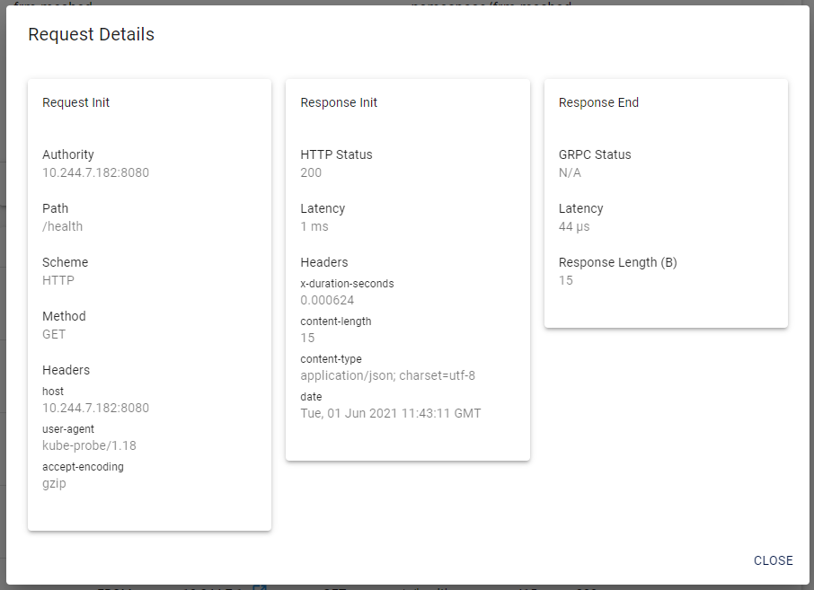

# Linkerd Deep Dive

- [Linkerd Deep Dive](#linkerd-deep-dive)
  - [How does Linkerd work?](#how-does-linkerd-work)
  - [What is a Container?](#what-is-a-container)
  - [Containers vs Pods](#containers-vs-pods)
  - [What is a Sidecar?](#what-is-a-sidecar)
  - [What is a Service Mesh?](#what-is-a-service-mesh)
  - [How does Linkerd Handle Scaling?](#how-does-linkerd-handle-scaling)
  - [Why use Linkerd at all](#why-use-linkerd-at-all)
    - [Runtime Debugging](#runtime-debugging)
    - [Observability](#observability)
    - [Reliability](#reliability)
    - [Security](#security)
- [Questions and Answers](#questions-and-answers)

## How does Linkerd work?

Linkerd runs by installing proxies next to each service instance known as Sidecars. These Sidecars handle traffic to and from the service. Because these Sidecars are placed next to the service instances, they have the ability to manipulate traffic to and from the service without adding latency. To understand this description the following deep-dive article was created that will delve into each of these concepts.

## What is a Container?

In simplified terms, a Container is a software package containing everything needed to run your application. This will include the installation instructions, the application codebase and execution instructions. These are written as commands in a Dockerfile and built into a docker image (this can be seen as a snapshot of the executed commands).

Here are the contents of a container compared to an old school Virtual machine setup:


[https://rancher.com/playing-catch-docker-containers]([https://rancher.com/playing-catch-docker-containers)

These containers can be deployed to Kubernetes by using a different set of instruction files that will reference the docker image you created. These instructions will let Kubernetes know how to host the docker image and what it needs to connect to, for example: ingress for inbound traffic, volume mounts for persistent storage, config maps for loading config without destroying the pod, secrets to share and utilise secrets such as SSL certificates.

## Containers vs Pods

Pods are how Kubernetes deploys and manager Containers, pods can contain more than one container and are created by building a Deploy instructions file. For ease of understanding remember it like this:

A cluster is made up of one or more nodes. Nodes are made up of one or more Pods. Pods are made up of one or more Containers.



## What is a Sidecar?

A sidecar is a utility container in a pod that’s loosely coupled to the main application container. Perhaps the most well-known use case of sidecars is proxies in a service mesh, but there are other examples, including log shippers, monitoring agents or data loaders. More than one sidecar can be applied to a pod. For ease of following, I will add some sidecars to the example image provided above.



It is possible to have replicas of the same pod run on different Nodes if needed. If this is the case Linkerd will add the sidecar to all of the replicas because the Linkerd sidecar instructions are stored in the Deployment instructions file inside of Kubernetes. This ensures that even if the pod has a fatal crash or gets deleted the sidecar will still be created alongside the Containers.

## What is a Service Mesh?

A service mesh in Kubernetes is a piece of software that operates at the network layer to provide visibility and manage communications between containers or pods. Most service meshes run by injecting a sidecar proxy into each Kubernetes pod and then communicating with all the sidecars for the collection of telemetry and the distribution of instructions. The following images from the Linkerd documentation show this well.

.png).png).png)

## How does Linkerd Handle Scaling?

Linkerd has a High Availability mode which will ensure that resource usage stays manageable, a pod is always available and will ensure that there are three running replicas of the Linkerd critical components (so that linkerd itself never goes down). Regarding our meshed services Linkerd will communicate with the Kubernetes autoscaler whenever it is needed to scale a pod up for any reason.

## Why use Linkerd at all

LinkerD makes running multiple services easier by providing the following without any changes to the service codebase:

### Runtime Debugging

Runtime debugging is provided by the Linkerd “Tap” functionality. This enables the user to inspect the requests to and from a pod. This Tap once connected streams the data received and sent by the Pod live:



Each of the requests above requests can also be inspected whilst the live feed is still active:


There is also functionality referred to as “Top” that enables us to view all the traffic from a namespace (a collection of meshed services) live:


Each of the requests listed above can also be used linked to the Tap function where they will be used as filters and you will only see the instances of that specific request.

### Observability

Observability is provided by collecting and storing telemetry and metrics data from the sidecars. This data can then be used to “keep an eye” on your containers.  
It shows the network statistics:



The container resource metrics:


The requests made to the Container:



A breakdown of each of these requests:



And last but not least it also shows Live TCP Metrics:


### Reliability

By ensuring high availability for Linkerd and each of the meshed Pods we can ensure that even in the event of the loss of Pods or an entire Node; the Pods will spin up again and fail all traffic over to replicas where applicable.

### Security

Linkerd can integrate with the most widely known ingress controllers to ensure that the traffic received by the Pod is secure and trusted. The most common and widely known ingress controllers are the following:

- Nginx
- Traefik
- GCE
- Ambassador
- Gloo
- Contour
- Kong

Each of which can secure connections in various different ways. By integrating these with Linkerd it will ensure that only trusted requests are accepted. This form of security also allows Linkerd to split and route the traffic to and from the Pods, this routing is done based on the request authority, request host or the request override headers.

Thank you for reading this short guide. If anything is unclear be sure to mention it in the comments below so that we can all benefit from the clarifications.

# Questions and Answers

1. How do we as developers mesh the namespace ourselves after we published a new function?

```bash
curl -sL run.linkerd.io/install | sh
```

```bash
export PATH=$PATH:/home/jbornman/.linkerd2/bin
```

```bash
kubectl config set-context --current --namespace=frm-meshed
```

```bash
kubectl get deploy -o yaml | linkerd --linkerd-namespace likerddev inject - | kubectl apply -f -
```
