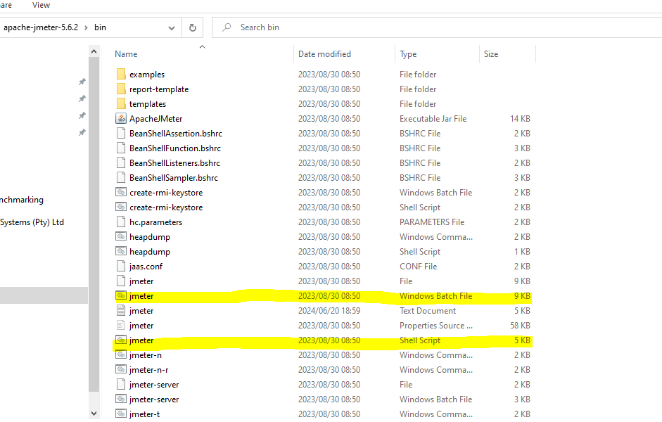
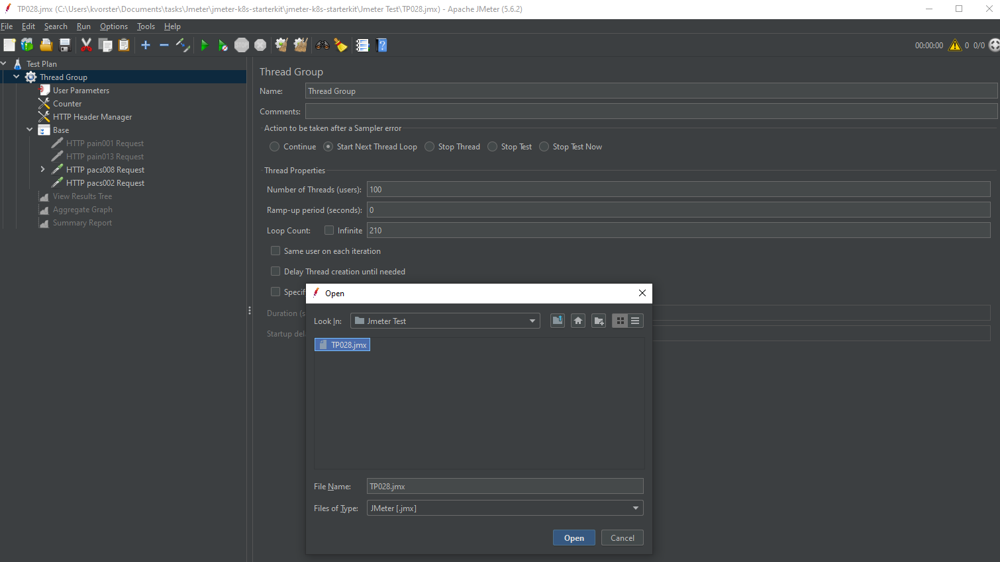
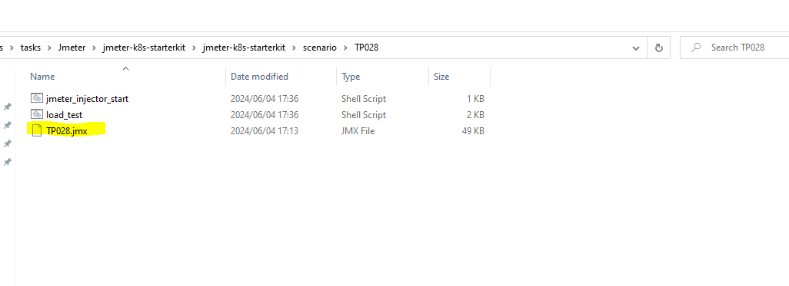
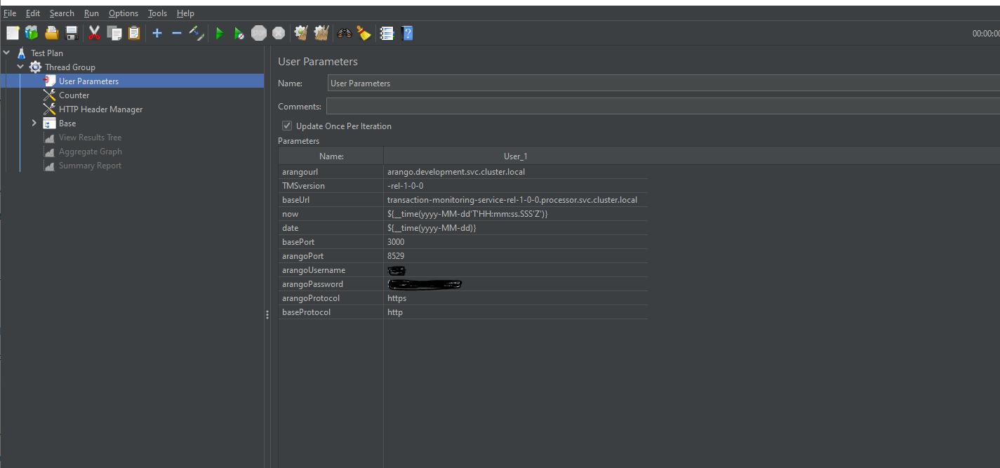

# Benchmarking using Jmeter

## Table of Contents

1. [Running JMeter Tests with Kubernetes Using JMeter Starter Kit](#running-jmeter-tests-with-kubernetes-using-jmeter-starter-kit)
   - [Prerequisites](#prerequisites)
   - [Downloading and Setting Up JMeter](#downloading-and-setting-up-jmeter)
     1. [Download JMeter](#1-download-jmeter)
     2. [Unzip JMeter](#2-unzip-jmeter)
     3. [Navigate to the JMeter `bin` Directory](#3-navigate-to-the-jmeter-bin-directory)
     4. [Launch JMeter GUI](#4-launch-jmeter-gui)
   - [Download JMeter Starter Kit](#download-jmeter-starter-kit)
     1. [Navigate to Github Repo](#1-navigate-to-github-repo)
     2. [Clone the Repo](#2-clone-the-repo)
   - [Loading and Modifying the JMeter Test File](#loading-and-modifying-the-jmeter-test-file)
     1. [Launch JMeter GUI](#1-launch-jmeter-gui)
     2. [Download Test File](#2-download-test-file)
     3. [Load Test File](#3-load-test-file)
     4. [Modify the Test](#4-modify-the-test)
   - [Deploying and Running the JMeter Test on Kubernetes](#deploying-and-running-the-jmeter-test-on-kubernetes)
     1. [Open a Linux Shell](#1-open-a-linux-shell)
     2. [Navigate to `start_test.sh` Folder](#2-navigate-to-start_testsh-folder)
     3. [Ensure Test Scenario Exists](#3-ensure-test-scenario-exists)
     4. [Run the Test](#4-run-the-test)
     5. [Accessing Test Reports](#5-accessing-test-reports)
     6. [Cleaning Up Report (Optional)](#6-cleaning-up-report-optional)
2. [Running JMeter Tests Locally](#running-jmeter-tests-locally)
   - [Modify User Parameters](#1-modify-user-parameters)
   - [Load and Modify Test File](#2-load-and-modify-test-file)
   - [Run the Test](#3-run-the-test)
3. [Conclusion](#conclusion)

# Running JMeter Tests with Kubernetes Using JMeter Starter Kit

This document outlines the steps to effectively run JMeter tests on a Kubernetes environment using the JMeter Starter Kit. The kit simplifies the process of deploying JMeter instances on Kubernetes and facilitates running load tests. Below are the steps to load, modify, deploy, and manage JMeter tests within a Kubernetes cluster.

[Getting started with JMeter](https://jmeter.apache.org/usermanual/get-started.html)

## Prerequisites

Before you start, ensure you have the following:

- A Kubernetes cluster up and running.
- `kubectl` configured to interact with your Kubernetes cluster.
- JMeter downloaded and unzipped on your local machine.
- The JMeter Starter Kit downloaded and set up on your local machine.

## Downloading and Setting Up JMeter

### 1. Download JMeter
- Download the JMeter zip file from [here](https://jmeter.apache.org/download_jmeter.cgi).

### 2. Unzip JMeter
- Extract the downloaded zip file to a preferred location on your computer.

### 3. Navigate to the JMeter `bin` Directory
- Go to the extracted folder and navigate to the `bin` directory.

### 4. Launch JMeter GUI
- For Windows: Run `jmeter.bat`.
- For Mac/Linux: Run `jmeter.sh`.

Once JMeter is running, you can load your test file.

 

## Download JMeter Starter Kit

In order to modify your test file, you will need to download the starter kit.

### 1. Navigate to Github Repo
- You can find the starter kit here: [Starter Kit](https://github.com/Rbillon59/jmeter-k8s-starterkit/tree/master)

### 2. Clone the Repo
- Clone the repository to your desktop using the following command:
  ```bash
  git clone https://github.com/Rbillon59/jmeter-k8s-starterkit.git
  ```

## Loading and Modifying the JMeter Test File

### 1. Launch JMeter GUI
- Open the JMeter GUI to make test modifications conveniently.
### 2. Dowload Test File

[Jmeter Test file.zip](./jmeter-test-file.zip)

### 3. Load Test File
- Use the JMeter GUI to load your test file. Navigate to **File > Open** and select the desired `.jmx` test file.

 

### 4. Modify the Test
- Make changes to the loaded test as needed using the GUI interface.
  - Changes can include Number of Threads and loop count that is found in the thread Group.
- Save the test file after making modifications.

  

## Deploying and Running the JMeter Test on Kubernetes

### 1. Open a Linux Shell
- Open a Linux shell environment. If you're on Windows, you can use Git Bash for compatibility.

### 2. Navigate to `start_test.sh` Folder
- Use the terminal to navigate to the directory containing the `start_test.sh` script, e.g., `.../jmeter-k8s-starterkit/start_test.sh`.

### 3. Ensure Test Scenario Exists
- Ensure that the scenario directory (e.g., `TP028`) is present within the scenario folder (`.../jmeter-k8s-starterkit/scenario/`), and it contains the relevant `.jmx` test file.

 
  
### 4. Run the Test
- Execute the following command to run the test on the Kubernetes cluster:
  ```bash
  ./start_test.sh -n development -j TP028.jmx -i 1 -r
  ```
  Replace the values as appropriate for your test:
  - `-n development`: Specify the namespace for deployment.
  - `-j TP028.jmx`: Specify the name of the JMeter .jmx file.
  - `-i 1`: Number of pods (instances) to deploy (optimal: 3 pods).
  - `-r`: Trigger the test run.

### 5. Accessing Test Reports
- After the test completes, you can access the reports generated by the master pod. Reports are usually located in the `/report` directory in the master pod's root.
- To download a report, use the following command:
  ```bash
  kubectl cp ${master_pod_name}:/report/${generated_report_folder} ./${destination_on_your_pc} -c jmmaster
  ```
  Replace `${master_pod_name}`, `${generated_report_folder}`, and `${destination_on_your_pc}` with the appropriate values.

### 6. Cleaning Up Report (Optional)
- Optionally, clean up the report folder on the master pod after downloading the reports to save space.

## Running JMeter Tests Locally

You can also run JMeter tests locally on your computer instead of on Kubernetes by following these steps:

### 1. Modify User Parameters
- Update the user parameters to point to an external endpoint instead of the local Kubernetes cluster. For example:
  - `arangoUrl`: Set to the external endpoint URL.
  - `baseUrl`: Set to the external endpoint URL.



### 2. Load and Modify Test File
- Load your test file into the JMeter GUI as described in the previous section.

### 3. Run the Test
- To run the test locally, simply click the green arrow button in the JMeter GUI.
  


### Conclusion

By following these steps, you can load, modify, deploy, and run JMeter tests on a Kubernetes cluster using the JMeter Starter Kit. This process streamlines the load testing process and allows you to effectively analyze application performance under different conditions. Remember to adapt the steps and commands based on your specific testing requirements and cluster setup.